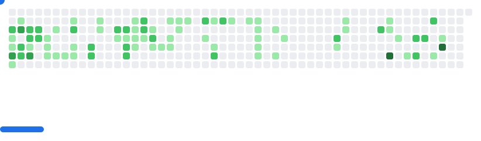

# askonev


```json
{
  "job": "AQA engineer",
  "birthday": "1994-07-19",
  "country": "Russian",
  "city": "Nisniy Novgorod",
  "stack": ["Javascript", "Python", "Ruby", "Docker", "AWS", "..."],
  "interest": ["Tech", "Plaing music", "Hiking", "..."]
}
```

<picture>
  <source
    media="(prefers-color-scheme: dark)"
    srcset="images/breakout-dark.svg"
  />
  <source
    media="(prefers-color-scheme: light)"
    srcset="images/breakout-light.svg"
  />
  
</picture>
